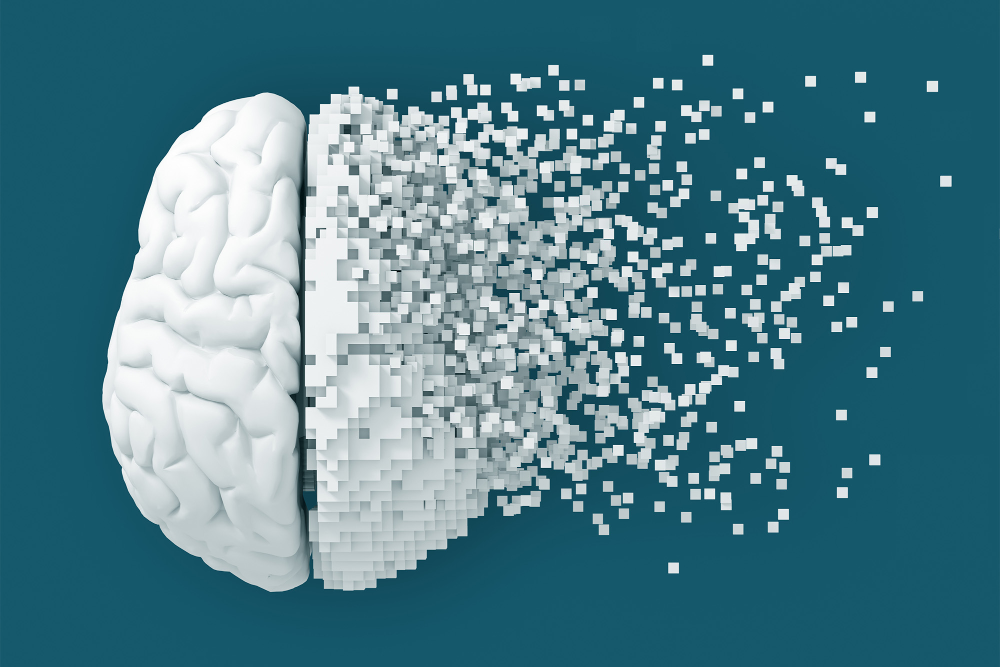
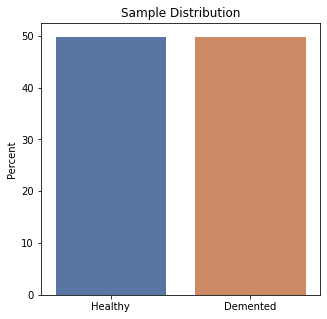

# Brain f-MRI Image Classification of Alzheimer's Diagnosis Using Deep Learning Modeling CNNs

**Author:** [Ilan Haskel](https://www.linkedin.com/in/ilan-haskel-86280812b/)

## Project Overview

My goal was to create a machine learning model capable of accurately diagnosing the presence of Alzheimer’s when fed an image of a patient’s f-MRI scan. I sought to minimize false-negative diagnoses, those where a patient has Alzheimer’s but the model predicts them to be healthy, all the while maximizing accuracy of predictions. In this way, my model could act as a reliable preliminary screening tool with a strong imperative to prevent patients who actually have Alzheimer’s from slipping through the diagnostic cracks. With this tool in place, diagnosticians and experts would only need to manually analyze imaging scans and conduct further imaging or testing if the model were to return a positive diagnosis. This would not only conserve hospital resources, but allow for more expedient and confident treatment to those diagnosed with Alzheimer’s Disease.

## I. Business Understanding

Alzheimer's Disease is a degenerative disease that currently has no cure, but can be treated if caught early enough to slow the disease and extend the duration of cognitive function in a given patient. Currently, fMRI (functional Magnetic Resonance Imaging) is but one small, optional piece of a multifaceted diagnostic process.

Tool-assisted interpretations of brain fMRI conducted by radiologists and neurologists in the diagnosis of Alzheimer’s are accurate between 70% and 90% of the time, and this is using a multimodal analysis that takes into account sMRI (structural MRI) and DTI (Diffusion Tensor Imaging) alongside fMRI [[1]](https://www.frontiersin.org/articles/10.3389/fneur.2019.00904/full). The implentation of an fMRI-based CNN machine learning tool in a hospital setting could not only improve accuracy in the diagnosis of AD, but also save hospitals time and money by reducing workloads for radiologists and potentially minimizing the need for other imaging techniques apart from fMRI. If used as a preliminary screening tool tuned to minimize false negative diagnoses of AD, experts would only need to manually analyze imaging scans and conduct further imaging if the model returns a positive diagnosis. This would not only conserve hospital resources, but allow for more expedient and confident treatment for those diagnosed with Alzheimer's Disease.

## II. Data Understanding

The data I used to train and subsequently test my model consisted of 6400 images of patient fMRI scans collected from several hospitals, websites, and data repositories, all gathered and made publicly available through [Kaggle](https://www.kaggle.com/datasets/sachinkumar413/alzheimer-mri-dataset). Initially, the data was separated into 4 distinct classes, non-demented (or healthy) brains scans, and three varying degrees of dementia indicating the presence of Alzheimer’s: very mild demented, mild demented, and moderate demented in increasing orders of severity. Due to the imbalanced nature of the data, particularly between the different severities of dementia, I chose to combine all the positive diagnoses of Alzheimer’s under one class - simply labeled Demented. In this way, I set up a perfectly balanced binary classification problem with exactly 50% of the data corresponding to each of healthy and demented brain scans.

The below graph shows the resulting distribution of the data:

Also, here are some examples of f-MRI images from each category:
