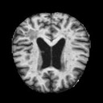
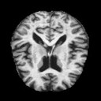
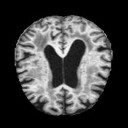
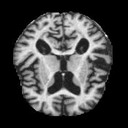
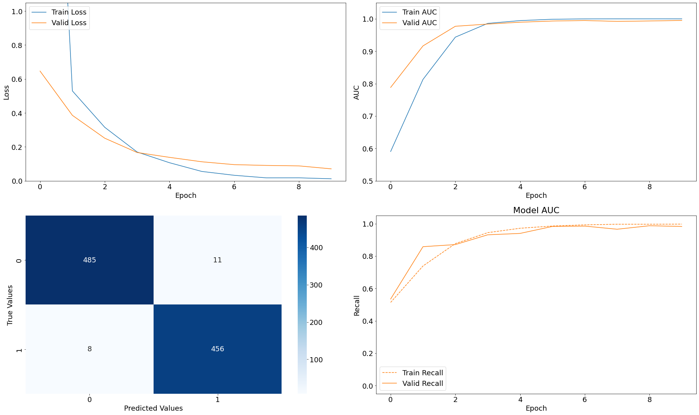
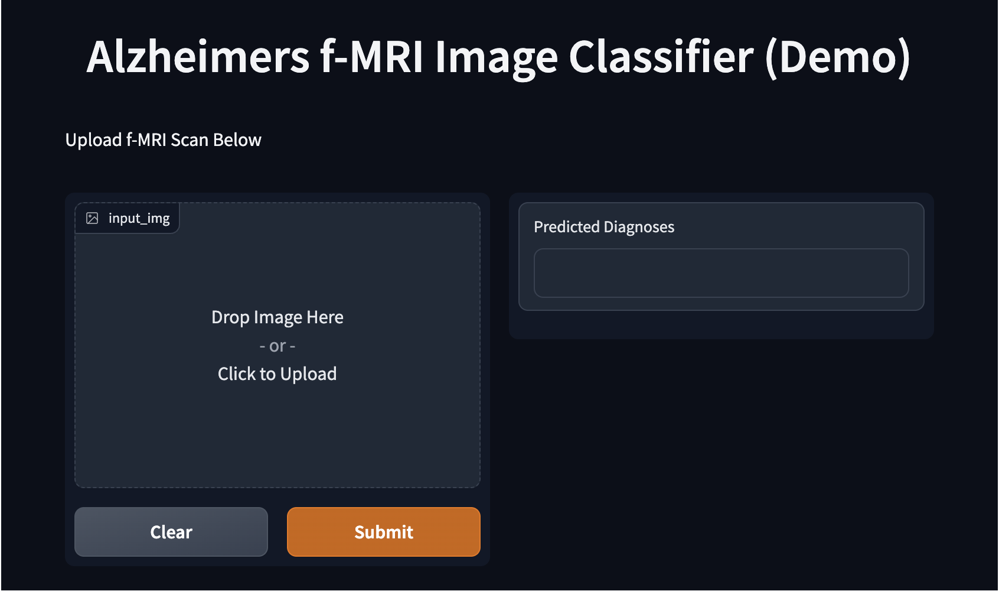

# Brain f-MRI Image Classification of Alzheimer's Diagnosis Using Deep Learning Modeling CNNs

**Author:** [Ilan Haskel](https://www.linkedin.com/in/ilan-haskel-86280812b/)

## Project Overview

My goal was to create a machine learning model capable of accurately diagnosing the presence of Alzheimer’s when fed an image of a patient’s f-MRI scan. I sought to minimize false-negative diagnoses, those where a patient has Alzheimer’s but the model predicts them to be healthy, all the while maximizing accuracy of predictions. In this way, my model could act as a reliable preliminary screening tool with a strong imperative to prevent patients who actually have Alzheimer’s from slipping through the diagnostic cracks. With this tool in place, diagnosticians and experts would only need to manually analyze imaging scans and conduct further imaging or testing if the model were to return a positive diagnosis. This would not only conserve hospital resources, but allow for more expedient and confident treatment to those diagnosed with Alzheimer’s Disease.

## I. Business Understanding

Alzheimer's Disease is a degenerative disease that currently has no cure, but can be treated if caught early enough to slow the disease and extend the duration of cognitive function in a given patient. Currently, fMRI (functional Magnetic Resonance Imaging) is but one small, optional piece of a multifaceted diagnostic process.

Tool-assisted interpretations of brain fMRI conducted by radiologists and neurologists in the diagnosis of Alzheimer’s are accurate between 70% and 90% of the time, and this is using a multimodal analysis that takes into account sMRI (structural MRI) and DTI (Diffusion Tensor Imaging) alongside fMRI [[1]](https://www.frontiersin.org/articles/10.3389/fneur.2019.00904/full). The implentation of an fMRI-based CNN machine learning tool in a hospital setting could not only improve accuracy in the diagnosis of AD, but also save hospitals time and money by reducing workloads for radiologists and potentially minimizing the need for other imaging techniques apart from fMRI. If used as a preliminary screening tool tuned to minimize false negative diagnoses of AD, experts would only need to manually analyze imaging scans and conduct further imaging if the model returns a positive diagnosis. This would not only conserve hospital resources, but allow for more expedient and confident treatment for those diagnosed with Alzheimer's Disease.

## II. Data Understanding

The data I used to train and subsequently test my model consisted of 6400 images of patient fMRI scans collected from several hospitals, websites, and data repositories, all gathered and made publicly available through [Kaggle](https://www.kaggle.com/datasets/sachinkumar413/alzheimer-mri-dataset). Initially, the data was separated into 4 distinct classes, non-demented (or healthy) brains scans, and three varying degrees of dementia indicating the presence of Alzheimer’s: very mild demented, mild demented, and moderate demented in increasing orders of severity. Due to the imbalanced nature of the data, particularly between the different severities of dementia, I chose to combine all the positive diagnoses of Alzheimer’s under one class - simply labeled Demented. In this way, I set up a perfectly balanced binary classification problem with exactly 50% of the data corresponding to each of healthy and demented brain scans.

The below graph shows the resulting distribution of the data:

Here are some examples of f-MRI images from each category:

Healthy   |  Very Mild Demented | Mild Demented | Moderate Demented
:-------------------------:|:-------------------------:|:-------------------------:|:---------------------:
  |   |  | 

## III. Data Preparation

After reading in the data, it was instantiated as images and labels and converted into a NumPy array for ease of processing. Then, I split the data into a training set, a validation set, and a test set, in order to begin modeling. Finally, I normalized the image matrices.

For more details on my data preparation process, please refer to the final notebook.

## IV. Disclaimer - Reproducibility

Due to limitations of local computing power (M1 Macs have certain technical difficulties when working with Tensorflow), all model creation and training had to be done using cloud computing via Google Colab. If interested in recreating this notebook, you will need to download the training data from [Kaggle](https://www.kaggle.com/datasets/sachinkumar413/alzheimer-mri-dataset) and upload it to your personal google drive, placing it in a folder titled 'data'. Within this folder, create separate additional folders for positive and negative alzheimer's diagnoses, and upload the relevant images of each kind into their respective folders. You can also copy [this](https://drive.google.com/drive/folders/1Z6Ro2Kx4_-ZwOhWxn-mzXspU6UnGup8Z?usp=sharing) folder from my own google drive containing the data as it needs to be organized. Furthermore, it appears that the random seeds did not work perfectly, so upon reproduction the models in the final notebook are likely to perform marginally different (~0.5% difference in accuracy from personal testing) to the results discussed in the evaluation sections of the notebook.

## V. Data Modeling

One of the most important factors in choosing a final model was the model’s ability to limit false negatives. Even if it made the model slightly less accurate overall, it was important that the model rarely classified Demented f-MRIs as Healthy f-MRIs.

For the first model, I chose to use a sequential model. The input layer was a 2D convolutional layer with a 3x3 convolutional window and a dimensionality of 128. The activation used was relu. The next layer (and first hidden layer) was a 2D max pooling layer which downsapled the input and extracted the features with the highest importance. The inclusion of a pooling layer was necessary for performance reasons, and max pooling was chosen specifically for its tendency to perform better in image classification tasks relative to other pooling methods such as average pooling. A flattening layer was added next to compress the output into a single-dimensional matrix, which was then fed into a dense layer with 512 nodes and a relu activation. A dense layer of this dimensionality could cause overfitting, but this was addressed in future iterations. Finally, our output layer was a dense layer with a sigmoid activation that squeezed the outputs between 0 and 1, returning the probability that the input belongs to the positive class (Demented) in this binary classification problem.

For compiling, I chose to use `adam` optimization for its computational efficiency and ability to handle large numbers of parameters. `binary_crossentropy` was used for the loss function as it is suitable for binary classification. Accuracy, AUC, and Recall were chosen as evaluation metrics due to their sensitivity towards false negatives and suitability for the business problem.

When evaluated on validation data, this first model yielded an accuracy score of ~98.3%, a recall score of ~98.8%, and an AUC of ~0.99, all of which approach the upper bounds of CNN performance. Furthermore, a confusion matrix showed that model predictions yielded only 6 false negatives out of the 960 predictions made on validation data. Notably and expectedly, this first model was still very overfit yielding a perfect accuracy.

For the second model, a 50% dropout layer was added to try and reduce overfitting. Everything else was kept the same. It appears that adding the dropout layer did help alleviate overfitting somewhat. Not only this, but accuracy also improved slightly. That said, this iteration of the model performed slightly worse on validation data, specifically in regards to false negatives. It is difficult to tell if this minor variance in performance was due to the construction of the model or the randomness of training.

For the third model I added two preprocessing layers incorporating data augmentation techniques, specifically random flipping and random rotating of images in the dataset. This was in an attempt to create greater diversity among training images and promote broader generalization to unseen data. The rest of the model stayed the same.

Unfortunately, it appears that adding the data augmentation layers made our model perform significantly worse on both validation and training data across all relevant metrics. Upon doing some research, it is possible that the current version of tensorflow is experiencing some bugs regarding the implementation of data augmentation in Sequential models, so the preprocessing layers were not chosen for inclusion in the final model.

The final model was defined in the same way as the second model, as it performed the most accurately, with the addition of some preprocessing layers that resize and rescale images such that images of any size can be run through the model once deployed. Overall, this model performed extremely well relative to current accuracy standards of f-MRI-based Alzheimer's diagnosis without becoming too overfit, as seen in the evaluation plots below:

The final model yielded an accuracy of ~98% and recall of ~98%, while only producing 8 false negatives through its predictions. This equates to a false-negative rate of under 1%.

## VI. Model Deployment - Gradio

I used Gradio to temporarily deploy a functional web-app version of the model running locally off of this notebook. Unfortunately, more permanent cloud-based hosting was untenable given the size of the resulting model and a lack of necessary computing power. If interested in recreating the app, follow the steps in the notebook after properly preparing the data. For reference of how deployment looks like, I have included the below screenshot of the web-app:

## Conclusion

My final model is able to diagnose Alzheimer's Disease with an accuracy superior to modern, tool-assisted, f-MRI interpretation conducted by radiologists and neurologists (98% accuracy). Furthermore, my model is designed to minimize false-negative diagnoses and does so with a false-negative rate of under 1%.

Given its speed and accuracy, the machine learning tool I've developed shows considerable promise in guiding physician decisions.

## Next Steps

1.   The model can continue to learn and adjust with new patient data. Training the model on additional patient data, including past and future data, will help improve the model's accuracy and fine-tune the model's performance for the hospital's patients.
2.   The current model will need to be integrated with a hospital's IT system to maintain patient confidentiality, ensure HIPAA compliancy, and create efficient workflows. I recommend testing the current model with a pilot system under supervision from experts. This period will both confirm the accuracy of the model and help adjust any system processes.
3.   It could be beneficial to train similar models using not only fMRI but also other imaging techniques, such as CT, PET, sMRI, and DTI. This would allow for further diagnostic confidence if each model were to return the same diagnosis. If there were to be a discrepancy or inconsistency between model predictions, it would signal experts to apply further scrutiny and consider using other diagnostic tools.

---

## For More Information:

See the full analysis in the [Notebook](./index.ipynb) or review this [presentation](./Presentation.pdf)

### Contact Information

Feel free to contact me through LinkedIn, email, or Github:

| Name & LinkedIn                                              | Email                  | Github                                         |
| ------------------------------------------------------------ | ---------------------- | ---------------------------------------------- |
| [Ilan Haskel](https://www.linkedin.com/in/ilan-haskel-86280812b/) | ilanhaskel97@gmail.com | [@ilanhaskel](https://github.com/ilanhaskel)   |
